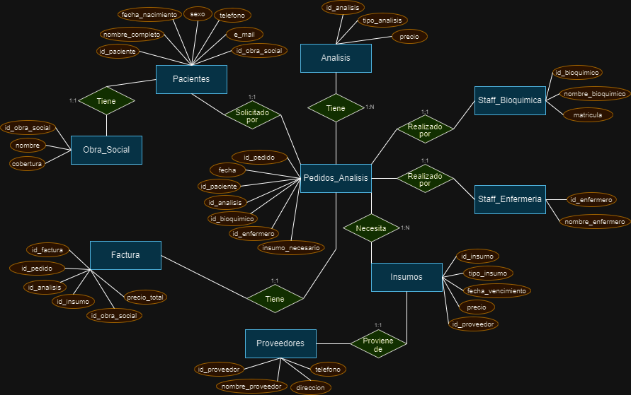

# Proyecto_Laboratorio-Nieto

Proyecto_Laboratorio-Nieto

Primera entrega

Victor Daniel Nieto


Descripción de la temática

En este proyecto me propongo trabajar a partir de una problemática relacionada a la administración de un laboratorio de análisis clínicos. Esta idea surge a partir de un interés personal por este modelo de negocio relacionado al ámbito de la salud por un vínculo familiar y me gustaría aprovechar lo aprendido a lo largo del curso para plantear una aplicación de un proyecto basado en un laboratorio real.

En esta primera instancia el objetivo está centrado principalmente en la creación de una base de datos que permita almacenar de manera óptima la información sobre los distintos pedidos de análisis que se realizan en el laboratorio. Posteriormente, se buscará avanzar sobre la inserción de datos, el mantenimiento de la base de datos y la aplicación de consultas y procedimientos que en un futuro puedan ser aprovechados para un análisis del negocio y la toma de decisiones con el objetivo de mejorar la eficiencia del trabajo.


Diagrama Entidad-Relación (D-E-R)
 


Listado de tablas
```
•	Analisis: Contiene la lista de análisis clínicos que pueden realizarse en el laboratorio y el precio de cada uno.
    o	id_analisis
    o	tipo_analisis
    o	precio

•	Staff_Bioquimica: Almacena información sobre los empleados del área de bioquímica.
    o	id_bioquimico
    o	nombre_bioquimico
    o	matricula

•	Staff_Enfermeria: Almacena información sobre los empleados del área de enfermería.
    o	id_enfermero
    o	nombre_enfermero

•	Insumos: Almacena información sobre los insumos necesarios para los análisis clínicos.
    o	id_insumo
    o	tipo_insumo
    o	fecha_vencimiento
    o	precio
    o	id_proveedor

•	Proveedor: Contiene la lista de proveedores de los cuales se obtienen los insumos así como datos generales de contacto de los mismos.
    o	id_proveedor
    o	nombre_proveedor
    o	direccion
    o	telefono

•	Pacientes: Almacena información sobre los pacientes que se realizan análisis clínicos.
    o	id_paciente
    o	nombre_completo
    o	fecha_nacimiento
    o	sexo
    o	telefono
    o	e_mail
    o	id_obra_social

•	Obra_Social: Contiene la lista de obras sociales con las cuales trabaja el laboratorio y la cobertura que proporciona cada una con respecto al precio de los análisis.
    o	id_obra_social
    o	nombre
    o	cobertura

•	Pedido_Analisis: Almacena información sobre los pedidos de análisis clínicos que se realizan en el laboratorio.
    o	id_pedido
    o	fecha
    o	id_paciente
    o	id_analisis
    o	id_bioquimico
    o	id_enfermero
    o	insumo_necesario

•	Factura: Registra las facturas emitidas por cada pedido de análisis.
    o	id_factura
    o	id_pedido
    o	id_analisis
    o	id_insumo
    o	id_obra_social
    o	precio_total
```

Grilla de tablas con campos, tipos de datos y tipos de claves
```
+---------------------------------------------------------------------------------------------------------+
| Tabla              | Campo	         | Nombre de campo completo	  | Tipo de dato  | Tipo de clave |
+---------------------------------------------------------------------------------------------------------+
| Analisis           | id_analisis	 | Identificador análisis	  | INT	          | PK            |
|	             | tipo_analisis	 | Tipo de análisis	          | VARCHAR (100) |               |
|	             | precio	         | Precio de análisis	          | DECIMAL (8,2) |               |
+---------------------------------------------------------------------------------------------------------+
| Staff_bioquimica   | id_bioquimico	 | Identificador bioquímico	  | INT	          | PK            |
|                    | nombre_bioquimico | Nombre de bioquímico	          | VARCHAR (60)  |               |
|	             | matricula	 | Matrícula de bioquímico	  | VARCHAR (25)  |               |
+---------------------------------------------------------------------------------------------------------+
| Staff_enfermeria   | id_ enfermero	 | Identificador enfermero        | INT	          | PK            |
|	             | nombre_ enfermero | Nombre de enfermero	          | VARCHAR (60)  |               |	
+---------------------------------------------------------------------------------------------------------+
| Insumos	     | id_insumo         | Identificador insumo	          | INT	          | PK            |
|	             | tipo_insumo	 | Tipo de insumo	          | VARCHAR (100) |               |
|	             | fecha_vencimiento | Fecha de vencimiento	          | DATE	  |               |
|	             | precio	         | Precio de insumo	          | DECIMAL (8,2) |               |
|	             | id_proveedor	 | Identificador proveedor	  | INT	          | FK            |
+---------------------------------------------------------------------------------------------------------+
| Proveedores	     | id_proveedor	 | Identificador proveedor	  | INT	          | PK            |
|	             | nombre_proveedor	 | Nombre de proveedor	          | VARCHAR (100) |               |
|	             | direccion	 | Dirección de proveedor	  | VARCHAR (100) |               |
|	             | telefono	         | Teléfono de proveedor	  | VARCHAR (20)  |               |
+---------------------------------------------------------------------------------------------------------+
| Pacientes	     | id_paciente	 | Identificador paciente	  | INT	          | PK            |
|		     | nombre_completo	 | Nombre completo de paciente	  | VARCHAR (100) |               |
|		     | fecha_nacimiento	 | Fecha de nacimiento	          | DATE	  |               |
|		     | sexo	         | Sexo de paciente	          | VARCHAR (9)	  |               |
|		     | telefono	         | Teléfono de paciente	          | VARCHAR (20)  |               |
|		     | e_mail	         | E-mail de paciente	          | VARCHAR (100) |               |
|		     | id_obra_social	 | Identificador obra social	  | INT	          | FK            |
+---------------------------------------------------------------------------------------------------------+
| Obra Social        | id_obra_social	 | Identificador obra social	  | INT	          | PK            |
|	             | nombre	         | Nombre de obra social	  | VARCHAR (100) |               |
|	             | cobertura	 | Cobertura de obra social	  | DECIMAL (8,2) |               |
+---------------------------------------------------------------------------------------------------------+
| Pedido_Analisis    | id_pedido	 | Identificador pedido	          | INT	          | PK            |
|		     | fecha	         | Fecha de pedido de análisis	  | DATETIME	  |               |
|		     | id_paciente	 | Identificador paciente	  | INT	          | FK            |
|		     | id_analisis       | Identificador análisis	  | INT	          | FK            |
|		     | id_bioquimico     | Identificador bioquímico	  | INT	          | FK            |
|		     | id_enfermero	 | Identificador enfermero	  | INT	          | FK            |
|		     | insumo_necesario	 | Insumo necesario para análisis | INT	          | FK            |
+---------------------------------------------------------------------------------------------------------+
| Factura            | id_factura	 | Identificador factura	  | INT	          | PK            |
|	             | id_pedido	 | Identificador pedido	          | INT	          | FK            |
|	             | id_analisis	 | Identificador análisis	  | INT	          | FK            |
|	             | id_insumo	 | Identificador insumo	          | INT	          | FK            |
|	             | id_obra_social	 | dentificador obra social	  | INT	          | FK            |
|	             | precio_total	 | Precio total	                  | DECIMAL (8,2) |               |	
+---------------------------------------------------------------------------------------------------------+
```


SEGUNDA ENTREGA

Proyecto_Laboratorio-Nieto

Victor Daniel Nieto


Para esta segunda entrega llevé a cabo la inserción de datos en la base de datos previamente creada. Para esto aproveché en mayor medida el recurso de la plataforma Mokaroo (https://www.mockaroo.com/) para crear datos de forma aleatoria siguiendo ciertos parámetros que fueran funcionales para las tablas que había creado, por otro lado también utilicé algunos tipos de análisis clínicos y precios aproximados calculados a partir del índice NBU (Nomeclador Bioquímico Único) obtenido a través de la biblioteca digital de la Confederación Unificada Bioquímica de la República Argentina (CUBRA) (https://cubra.org.ar/biblioteca/).

En este mismo repositorio agrego el script de inserción de datos mediante un archivo .sql con el nombre "Proyecto_Laboratorio_Nieto_segunda_entrega".
El orden de inserción en las tablas es el planteado en el script, este mismo fue probado en MySQL Workbench y funciona correctamente ejecutando el script entero.
Una aclaración sobre cambios que realicé que están presentes en el script es la modificación del tipo de dato de dos columnas pertenecientes a dos tablas. Por un lado modifiqué la columna cobertura de la tabla Obra_Social cambiando el tipo de dato a VARCHAR para que pudiera ingresar valores numéricos más el símbolo de porcentaje, y por otro lado, modifiqué la columna id_obra_social de la tabla Pacientes pasando permitiendo que admitiera valores nulos. En este último caso lo hice considerando que posteriormente pudiera recibir valores nulos equivalentes a pacientes que no tengan una obra social.
